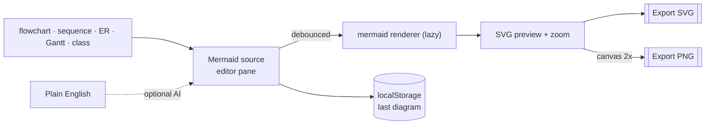

# oriz-diagram

> Diagram-as-code studio — a live Mermaid editor in your browser with SVG/PNG export. 100% client-side.

[](./LICENSE)
[](https://github.com/chirag127/oriz-diagram/stargazers)
[](https://github.com/chirag127/oriz-diagram/commits/main)
[](https://astro.build)
[](https://diagram.oriz.in)

Diagram-as-code studio — a live **Mermaid** editor in your browser.

- **Live app:** https://diagram.oriz.in _(canonical — Cloudflare Pages)_
- **About / info:** https://chirag127.github.io/oriz-diagram/ _(GitHub Pages landing)_
- **Repo:** https://github.com/chirag127/oriz-diagram
- **llms.txt:** https://diagram.oriz.in/llms.txt

Type a diagram in text, watch it render instantly, export **SVG** or **PNG**. Templates for flowchart, sequence, ER, Gantt, and class. Optional AI turns plain English into Mermaid and fixes broken syntax.

> **100% client-side. No upload. No signup. Free.** Rendering, validation, and export all run in your browser. Your diagram source never leaves your machine.

**⭐ If this is useful, please [star the repo](https://github.com/chirag127/oriz-diagram/stargazers) — it helps others find it.**

## How it works



## Features

- **Live Mermaid editor** — split code / preview, renders as you type (debounced), zoom controls.
- **Templates** — flowchart · sequence · ER · Gantt · class, one click each.
- **Export** — SVG (vector) and PNG (2× raster from the SVG via canvas).
- **Drag-drop** — drop a `.mmd` / `.txt` file onto the preview to load it.
- **AI (optional)** — English → Mermaid, or "fix syntax" on a parse error. Powered by [`@chirag127/oz-ai`](https://github.com/chirag127/design-system) (g4f multi-provider failover, no key). If AI is down, the editor still works.
- **Persistence** — your last diagram is remembered in `localStorage`.
- **Instant first paint** — the heavy Mermaid renderer is lazy-loaded on first render only.

## Tech

Client-only Astro static build · React 19 islands · Tailwind v4 · `mermaid` · shared `@chirag127/oz-*` packages (AI, file, tokens, chrome). PWA-installable.

## Develop

```bash
npm install --legacy-peer-deps
npm run dev      # local dev
npm run build    # static build -> dist/
npm test         # vitest (pure logic)
npm run deploy   # build + wrangler pages deploy
```

Windows: use **npm** (not pnpm — pnpm skips `@esbuild/win32-x64` and crashes the build).

## Two surfaces

- **Cloudflare Pages** serves the live app at [diagram.oriz.in](https://diagram.oriz.in).
- **GitHub Pages** serves the [about/info page](https://chirag127.github.io/oriz-diagram/) (from `gh-info/`, published by `.github/workflows/gh-pages-info.yml`).

## Part of the oriz family

One of ~80 small, fast, single-purpose tools and sites in the **oriz** fleet — see [blog.oriz.in](https://blog.oriz.in) for how it's built and run solo. Sibling tools: [json.oriz.in](https://json.oriz.in) · [case.oriz.in](https://case.oriz.in) · [name.oriz.in](https://name.oriz.in) · [resume.oriz.in](https://resume.oriz.in).

**Cost:** $0 — static build hosted free on Cloudflare Pages; AI is keyless (g4f) and client-side.

## Contributing

Issues and PRs welcome. Conventional commits are the changelog.

## Author

Chirag Singhal · chirag@oriz.in

## Status

Stable.

## License

MIT © 2026 Chirag Singhal
